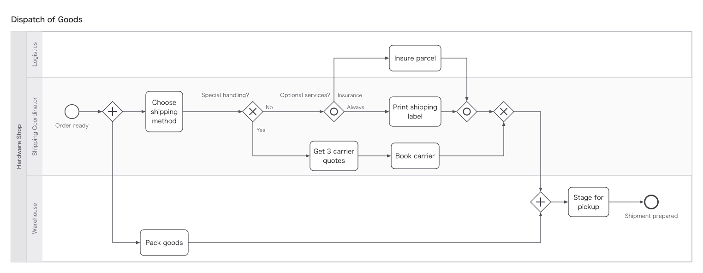
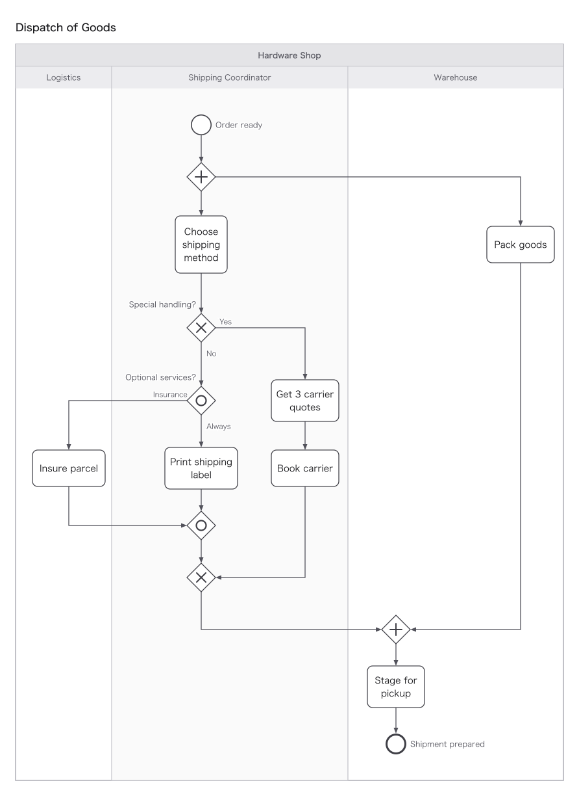

# Process Model Generator

A ChatGPT / Codex Plugin and Skill that deterministically generates semantically grounded, BPMN-styled swimlane diagrams (SVG) from business descriptions, interview notes, or BPMN XML.

[](LICENSE)
[](package.json)

## Example Output

The same [dispatch-of-goods workflow](skills/process-model-generator/examples/dispatch-of-goods.flow), with three lanes and parallel, exclusive, and inclusive gateways, rendered in both orientations by the bundled compiler.

### Horizontal



### Vertical



> **Why Process Model Generator?**
> LLM-generated diagrams (such as raw Mermaid or direct image generation) frequently suffer from tangled lines, illegible crossings, and broken business logic (such as missing responsibility boundaries or distorted decision conditions).
> Process Model Generator separates those concerns: **the LLM extracts the logical structure** (who does what, under what conditions, and with what artifacts), while **a deterministic compiler calculates layout geometry and routing**. The result is reproducible, and remaining semantic or readability risks are reported for review.

The canonical plugin manifest is [.codex-plugin/plugin.json](.codex-plugin/plugin.json), and [skills/process-model-generator/](skills/process-model-generator/) contains the complete skill. [src/](src/) and the root [scripts/](scripts/) directory contain development and release tooling.

## Key Features

- **Natural Language to Diagrams**: Organizes participants (pools & lanes), handoffs, decision branches, and artifacts from plain-text business descriptions into swimlane SVGs with compiler diagnostics.
- **Deterministic, Reproducible Layout**: No random seeds or LLM coordinate guessing. The compiler computes node placement, collision avoidance, and line routing deterministically.
- **BPMN 2.0 XML Ingestion**: Mechanically converts existing BPMN 2.0 XML into editable models with source attribution.
- **Three-Layer Quality Checks**: Checks syntax, reports selected structural and semantic risks (such as gateway and message integrity), and measures visual readability on a standard 1600×900 canvas.
- **Git-Friendly Text Intermediate Format**: Uses a lightweight text format (`.flow`) under the hood, making version control, diff reviews, and manual fine-tuning straightforward.

*Note: This tool is not an execution engine for deploying executable BPMN to Camunda, nor is it a general-purpose image editor.*

---

## Quick Start

After [installing](#installation) the plugin or standalone skill, prompt the agent with business context in natural language.

### Using with AI (Codex / ChatGPT)

```text
Using $process-model-generator, create a grounded swimlane diagram from this business workflow:

Workflow:
- An applicant drafts an approval request and submits it to their manager.
- If approved, the request completes. If rejected, the request closes.
```

The AI extracts the logical structure, converts it to the internal intermediate representation (`.flow`), and generates an SVG with compiler diagnostics.

### Using the CLI

Render a `.flow` file with the compiler bundled in the repository:

```bash
node skills/process-model-generator/scripts/process-model-generator.mjs inputs/flow/process.flow -o outputs/preview/process.svg --strict
```

---

## Installation

Each release provides two distribution ZIP packages. Both bundle the pre-built compiler in the skill's `scripts/` directory, so end users do not need to run `npm install` (Node.js >= 18 is required). Package integrity can be verified with `SHA256SUMS`.

| Package | Target Environment | Description |
|---|---|---|
| `process-model-generator-plugin-X.Y.Z.zip` | Codex Plugin | Includes `.codex-plugin/plugin.json`, `skills/process-model-generator/`, and the bundled compiler |
| `process-model-generator-skill-X.Y.Z.zip` | ChatGPT Skill | Standalone skill package with `SKILL.md` at the zip root for **Skills → Create → Upload skill** |

### Codex Plugin

Add this GitHub repository as a Codex marketplace source:

```bash
codex plugin marketplace add mssoftjp/process-model-generator
```

Then run `/plugins` in Codex CLI, select **Process Model Generator**, and install it. Start a new Codex session before using the bundled skill.

### Standalone Skill

To use the skill standalone without the plugin wrapper, extract `process-model-generator-skill-X.Y.Z.zip`.

Skill metadata is in [agents/openai.yaml](skills/process-model-generator/agents/openai.yaml), and detailed decision procedures are defined in [SKILL.md](skills/process-model-generator/SKILL.md).

### ChatGPT Web

For individual use on ChatGPT Web:
1. Navigate to [Skills](https://chatgpt.com/skills).
2. Click **Create → Upload skill**.
3. Upload `process-model-generator-skill-X.Y.Z.zip`.

---

## Internal Intermediate Representation (.flow)

The tool uses a lightweight textual DSL (`.flow`) as an intermediate representation between LLM understanding and the deterministic rendering engine. It can also be inspected and edited directly.

```flow
flow approval-request

pool internal[Company]
lane Applicant
  start s[Request started]
  task draft[Draft request]
  task revise[Revise request]
lane Manager
  xor review[Approval decision]
  end done[Approved]

s -> draft
draft -> review
review => done: Approved
review -> revise: Revision required
revise -> draft
```

### Core Syntax

| Syntax | Semantics |
|---|---|
| `->` | Sequence Flow |
| `=>` | Primary Path Sequence Flow (rhetorical emphasis; not a BPMN Default Flow) |
| `->>` | Loop Return Sequence Flow (rhetorical layout hint; does not reverse arrow direction) |
| `->/` | BPMN Default Sequence Flow (slashed start point) |
| `->?` | Sequence Flow with Inferred Relationship (provisional mark) |
| `~>` | Message Flow across pools |
| `-.->` | Data Association |
| `-.-` | Undirected Association |
| `..>` | Directed Association |
| `<..>` | Bidirectional Association |
| `and` / `xor` | Explicit Parallel / Exclusive Gateway |
| `orientation vertical` | Vertical diagram orientation (vertical lane bands, top-to-bottom time axis; default: `horizontal`) |

Events and boundary event example:

```flow
lane Intake
  start(message) s[Request received]
  task(user,loop) review[Review request]
  boundary(timer) timeout[Deadline reached] @review
  mid(message,throw) ping[Send notice]
  xor g[Decision]
  end(terminate) e[Terminated]
s -> review
review ->/ g
g -> ping: Condition met
ping -> e
timeout -> e
```

Orientation (`orientation vertical`) is rhetorical, similar to `=>`, and does not alter underlying semantics (topology, main path, or return edges). Both horizontal and vertical layouts share the same normalization, tabular placement, and routing planning algorithms, tested against identical fuzz-oracles (`O-*`). Vertical orientation suits long timelines targeted for vertical media (e.g., reports, mobile screens).

Detailed authoring rules and syntax reference are in [SKILL.md](skills/process-model-generator/SKILL.md).

---

## Diagnostics and BPMN Scope

The compiler reports DSL errors, selected structural and semantic risks, and visual readability against a 1600×900 display budget. `W-` denotes warnings, `E-` denotes errors in `--strict` mode, and `N-` denotes informational notices.

| Code | Example check |
|---|---|
| `W-207` | Invalid Message Flow endpoint |
| `W-235` / `W-236` | Missing incoming reply or unresolved one-way message |
| `W-440` | Fit-to-screen text is too small; use the complete SVG at native size |
| `W-441` | Fit-to-screen lane axis is unreadable; scrolling and zoom remain available in strict mode |
| `N-440` | Scaled text, lane, time-axis, and crossing-hop summary |

The supported subset covers common Process / Collaboration notation: pools and lanes, events, gateways, activities, collapsed subprocesses, data and artifacts, and sequence, message, data, and association flows. It does not claim full BPMN Process Modeling Conformance and does not provide execution semantics, nested expanded subprocess layout, Choreography / Conversation diagrams, manual BPMN DI coordinates, or vendor-specific extensions.

Data associations follow data direction: `task -.-> doc` writes an artifact and `doc -.-> task` reads it; the same rule applies to `store`. Cross-pool delivery uses a payload-labeled message flow between send and receive activities, with a separate receiving-side artifact when the received item is retained.

See the [advanced DSL reference](skills/process-model-generator/references/dsl-advanced.md) for the complete diagnostic list, supported constructs, and BPMN XML conversion behavior. A successful compile proves neither business correctness nor delivery readiness; generated SVGs still require semantic and visual review.

---

## Development and Testing

Dependencies only need to be installed when modifying TypeScript source files. Rebuild the bundled compiler after source changes. `npm test` also verifies that the bundled compiler matches the TypeScript source.

Developer documentation is indexed in [docs/README.md](docs/README.md). Routing, port, measurement, and SVG invariants are documented in the [process diagram style specification](docs/architecture/style-spec.md).

```bash
npm install
npm run build
npm test
```

## Versioning and Release

[VERSION](VERSION) at the repository root is the single source of truth. `package.json`, `package-lock.json`, and plugin manifests are mechanically synchronized.

Check current version and synchronization status:

```bash
npm run version:show
npm run version:check
```

Prepare a release candidate (bumps version, rebuilds JS bundle, runs full test suite, and generates release ZIPs and `SHA256SUMS` in `dist/`):

```bash
npm run release:prepare -- patch
npm run release:prepare -- minor
npm run release:prepare -- 0.2.0-rc.1
```

Review diffs and generated artifacts, commit, and push the `vX.Y.Z` tag. GitHub Actions will verify tag consistency with `VERSION` and publish the release assets. To re-package ZIPs for an existing version without bumping:

```bash
npm run release:package
```

Public distribution structure:

```text
.
├── .codex-plugin/
│   └── plugin.json
├── skills/
│   └── process-model-generator/
│       ├── SKILL.md
│       ├── agents/
│       ├── references/
│       └── scripts/
├── docs/
│   ├── README.md
│   ├── architecture/
│   ├── history/
│   ├── reference/
│   └── validation/
├── VERSION
├── scripts/
│   ├── build.mjs
│   ├── check-public-tree.mjs
│   └── release.mjs
├── src/
├── test/
├── package.json
├── LICENSE
└── README.md
```

Generated outputs, dependencies, caches, and secrets are excluded by `.gitignore`. Machine-local design notes, fixtures, and working inputs can be excluded with `.git/info/exclude` without weakening the public repository policy.

## License

[MIT License](LICENSE). `package.json` specifies `"private": true` to prevent unintended publishing to the public npm registry.

Developed by Musashino Software.
